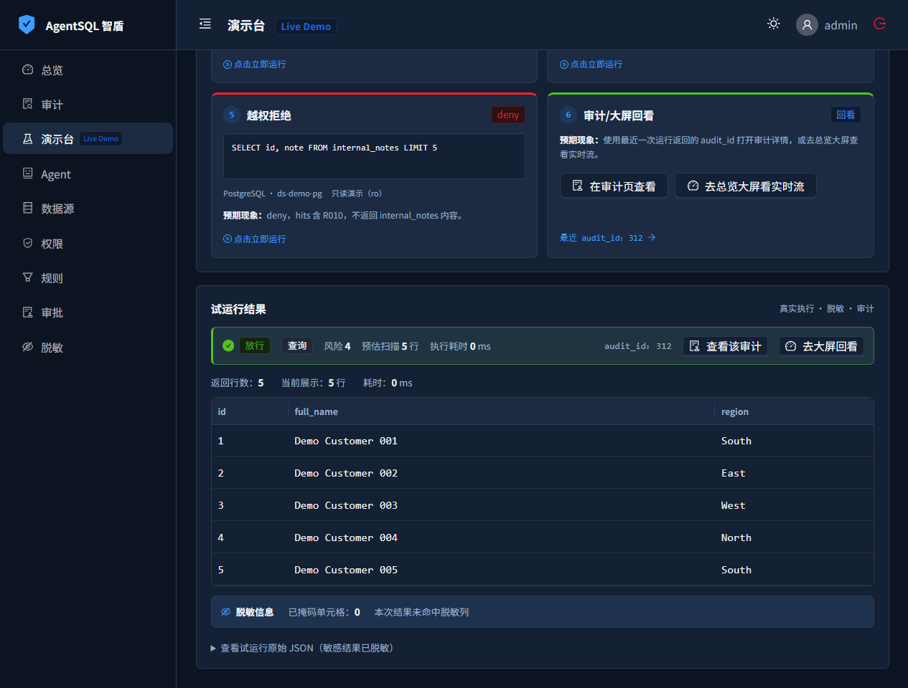
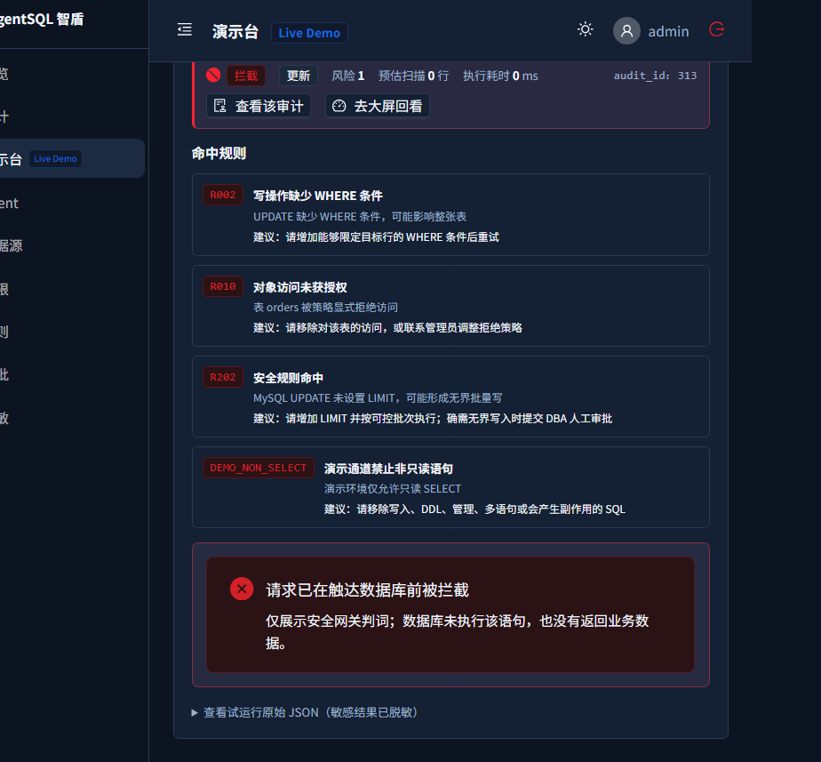
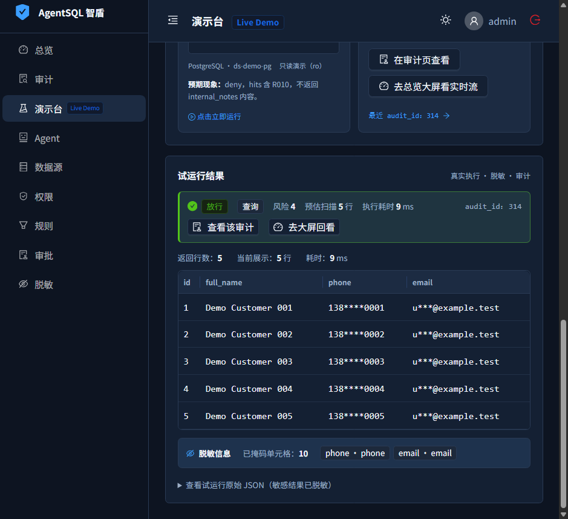
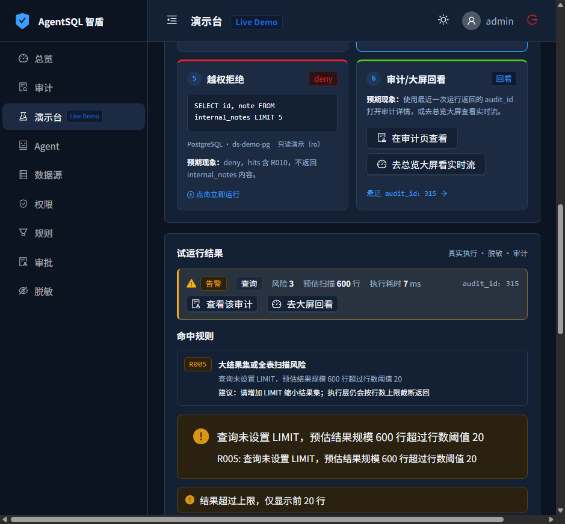
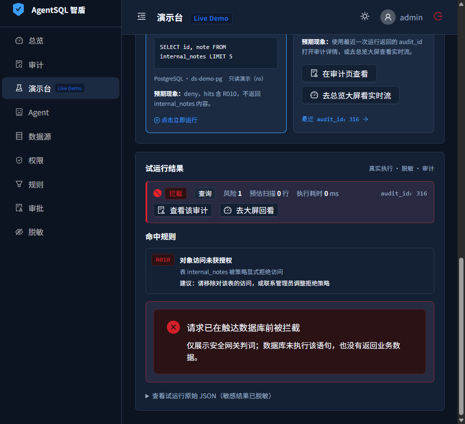
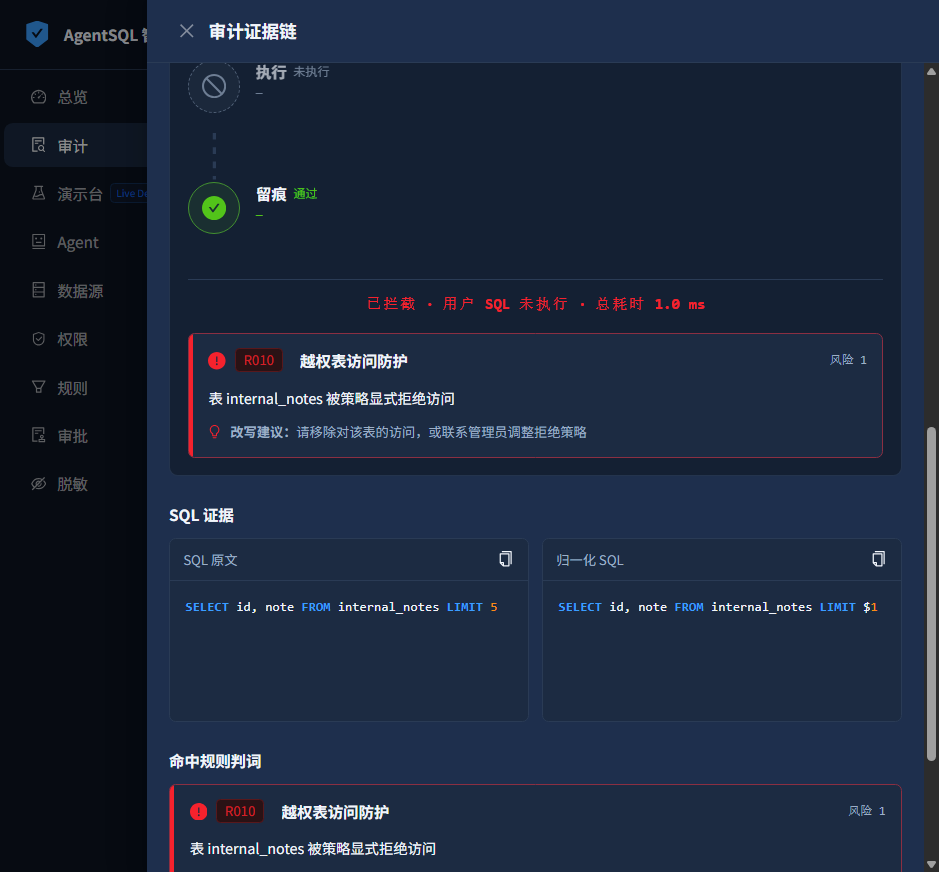

# AgentSQL


[](go.mod)
[](LICENSE)
[](COMMERCIAL-LICENSE.md)

AgentSQL（中文品牌名：智盾，控制台显示为「AgentSQL 智盾控制台」）是面向 AI Agent 的数据库安全网关与生产级 MCP Server：让模型发出的每条 PostgreSQL/MySQL 请求在到达数据库前，经过身份认证、SQL 解析、授权与规则评估、受控执行、结果脱敏和审计。

```text
AI Agent → LLM / MCP Client → AgentSQL 网关 → PostgreSQL / MySQL
                                  │
                                  └─ 鉴权 · 授权 · 规则 · 审批 · 脱敏 · 审计
```

## 核心特性

- 双 MCP 承载：本机 `stdio` 与 Streamable HTTP `/mcp`，提供 7 个受控数据库工具。
- 默认拒绝的安全链路：API Key 认证、Agent 能力档位、对象/列授权、SQL AST 规则与 fail-closed 错误处理。
- 受控读写：只读保护、危险 SQL 拦截、Explain 风险评估、超时、连接/QPS/结果行数限制和人工审批。
- 基础数据保护：列级脱敏支持六类 `mask` 部分遮蔽，以及带专用密钥的不可逆 HMAC 哈希指纹；`generic` 可对通用敏感值做 `hash`。数据源口令另由 32 字节 `AGENTSQL_SECRET` 加密保存。
- 可追溯运维：默认零配置 SQLite；可选 PostgreSQL 15+ 控制面（PostgreSQL 18 为基准，metadata 与 audit 可分库）；支持审计导出、审批决策闭环、Prometheus 指标与健康/就绪探针。
- 安全事件通知：按决策过滤并以 Webhook 或 Syslog 旁路外发；默认关闭、默认不含 SQL，通知失败不影响审计与 SQL 决策。
- 内嵌 Web 控制台：总览、审计、演示台、Agent、数据源、权限、规则、审批和脱敏规则管理。

## 5 分钟快速开始

以下三条路径都默认只在宿主机回环地址监听。自动安装器生成的是持久使用的**管理员密码**，不是一次性口令；远程访问请使用 SSH 本地转发，例如 `ssh -L 7780:127.0.0.1:7780 user@server`，不要直接向公网暴露 7780。

### 1. Linux 裸机一行安装（推荐）

要求 x86_64、glibc 2.28+ 且 systemd 为 PID 1；安装器会校验发布包外层与包内哈希，并安装为 systemd 服务：

```bash
curl -fsSL https://github.com/cuipengdba/agentsql/releases/latest/download/install.sh | sudo sh -s -- install
```

管道和 CI 的非 TTY 输出不会显示自动生成的管理员密码；root 可在 `/etc/agentsql/agentsql.env` 查看。交互终端会在首次创建凭据时显示一次，也可显式加 `--show-password`。离线环境同时取得 tarball 与同名 `.sha256` 后，校验、解压并从包根安装：

```bash
sha256sum -c agentsql-v0.2.0-linux-amd64.tar.gz.sha256
tar -xzf agentsql-v0.2.0-linux-amd64.tar.gz
cd agentsql-v0.2.0-linux-amd64
sudo ./install.sh install
```

### 2. Docker 一行启动

脚本默认拉取 GitHub 最新稳定 Release 对应的精确 GHCR tag，生成权限为 `0600` 的 `.env`，使用 `agentsql-data` 命名卷，并固定绑定回环地址：

```bash
curl -fsSL https://raw.githubusercontent.com/cuipengdba/agentsql/main/scripts/quickstart.sh -o quickstart.sh && sh quickstart.sh
```

GHCR 包必须由发布者设为 public，以上命令才能在未登录环境匿名拉取。等价的单条 `docker run` 如下；随机值只通过当前 shell 环境传入，不写进命令行参数：

```bash
export AGENTSQL_SECRET="$(openssl rand -base64 24)" AGENTSQL_ADMIN_USER=admin AGENTSQL_ADMIN_PASSWORD="$(openssl rand -base64 18)"
docker run -d --name agentsql --restart unless-stopped --security-opt no-new-privileges:true -p 127.0.0.1:7780:7780 -e AGENTSQL_SECRET -e AGENTSQL_ADMIN_USER -e AGENTSQL_ADMIN_PASSWORD -v agentsql-data:/var/lib/agentsql ghcr.io/cuipengdba/agentsql:v0.2.0
```

### 3. 本地 Live Demo（一条命令）

这套独立环境只连接仓库生成的 PostgreSQL/MySQL 合成数据，不连接真实数据库。复制环境样例、替换其中全部公开凭据后运行：

```bash
cp examples/docker/demo.env.example demo/demo.env && bash ./demo/reset.sh
```

Windows PowerShell：

```powershell
Copy-Item examples/docker/demo.env.example demo/demo.env; .\demo\reset.ps1
```

打开 <http://127.0.0.1:17880>。Live Demo 页面通过仅在 demo 模式注册的 `POST /api/v1/playground/run` 走真实网关链路；普通部署仍只提供不连库的静态评估。页面内置 6 个剧本：正常放行、无 WHERE 写拦截、以 phone/email 为演示数据的脱敏、大结果扫描告警、越权表拒绝，以及审计/大屏回看。

六剧本真实运行截图（Live Demo 走真实网关链路；演示数据可由重置脚本或外部计划任务定期重建）：

1. **正常放行（allow）**：只读点查真实返回 5 行，生成 `audit_id` 并留痕。

   

2. **无 WHERE 写拦截（deny）**：命中 R002 / R010 / R202 / DEMO_NON_SELECT，在触达数据库前拦截，不执行语句，也不暴露底层数据库报错。

   

3. **结果脱敏（allow）**：该演示剧本覆盖 `phone` / `email` 列（如 `138****0001`），表格与原始 JSON 中均看不到完整手机号 / 邮箱；产品能力还支持身份证、银行卡、IP 和出生日期，六类说明见[敏感列发现指南](docs/DISCOVERY.md)。

   

4. **大结果告警（warn）**：命中 R005，预估扫描 600 行超出行数阈值，仅返回前 20 行并标记 `truncated=true`。

   

5. **越权表拒绝（deny）**：命中 R010，`internal_notes` 被策略显式拒绝访问，不返回该表任何内容。

   

6. **审计证据链**：六段安检时间线（鉴权 / 解析 / 安检 / 决策 / 执行 / 留痕），被拦截语句标记为“未执行”，留存 SQL 原文、归一化 SQL 与命中规则判词。

   

凭据替换、手工 Compose 命令、通过外部计划任务定期重置和公开部署安全清单见 [Live Demo 指南](docs/DEMO.md)。

## 其他安装方式（源码构建、离线与审计环境）

需要审计每一步、修改 Compose 配置或从源码构建时，可继续使用原有流程。Docker Compose 默认只启动 AgentSQL，元数据和审计写入命名卷 `agentsql-data` 中的 `/var/lib/agentsql/agentsql.db`：

```bash
cp examples/docker/.env.example .env
openssl rand -base64 24   # 填入 AGENTSQL_SECRET，输出恰好 32 个 ASCII 字节
openssl rand -base64 24   # 填入 AGENTSQL_ADMIN_PASSWORD
docker compose up -d --build
docker compose ps
```

PowerShell 可分别执行两次以下命令并填写两个变量：

```powershell
$bytes = [byte[]]::new(24); $rng = [System.Security.Cryptography.RandomNumberGenerator]::Create(); $rng.GetBytes($bytes); [Convert]::ToBase64String($bytes); $rng.Dispose()
```

访问 <http://127.0.0.1:7780>。Compose 也只在宿主机回环地址暴露端口。需要可观测性栈时，先在环境中设置自行生成并保存的随机值，再运行：

```bash
docker compose --profile observability up -d --build
```

完整说明见 [可观测性示例](examples/observability/README.md)。`AGENTSQL_SECRET` 必须与 `agentsql.db` 成对备份；直接更换 SECRET 会让既有数据源口令无法解密。生产控制面可将 metadata 与 audit 分别放入独立的 PostgreSQL 15+ 数据库，完整迁移、最小权限和回滚流程见 [部署指南](docs/DEPLOY.md#postgresql-控制面部署)。

源码二进制构建需要 Go 1.25、cgo、C 编译器和 glibc 兼容环境；普通构建直接使用仓库已有的内嵌控制台产物，不需要 Node.js。

```bash
make build VERSION=v0.2.0
./bin/agentsqlctl init-config -o config.yaml
export AGENTSQL_SECRET="$(openssl rand -base64 24)"
export AGENTSQL_ADMIN_USER='admin'
export AGENTSQL_ADMIN_PASSWORD="$(openssl rand -base64 24)"
./bin/agentsql serve -c config.yaml
```

Windows PowerShell：

```powershell
./bin/agentsqlctl.exe init-config -o config.yaml
$bytes = [byte[]]::new(24); $rng = [System.Security.Cryptography.RandomNumberGenerator]::Create(); $rng.GetBytes($bytes); $env:AGENTSQL_SECRET = [Convert]::ToBase64String($bytes); $rng.Dispose()
$env:AGENTSQL_ADMIN_USER = 'admin'
$passwordBytes = [byte[]]::new(24); $passwordRng = [System.Security.Cryptography.RandomNumberGenerator]::Create(); $passwordRng.GetBytes($passwordBytes); $env:AGENTSQL_ADMIN_PASSWORD = [Convert]::ToBase64String($passwordBytes); $passwordRng.Dispose()
./bin/agentsql.exe serve -c config.yaml
```

`agentsqlctl check-config -c config.yaml` 只校验配置，不要求凭据；`agentsqlctl migrate -c config.yaml` 会校验 SECRET 后执行元数据库迁移。

## MCP 接入

先在控制台创建 Agent、配置数据源和授权策略，并保存只显示一次的 `asql_...` API Key。

### stdio

```json
{
  "mcpServers": {
    "agentsql": {
      "command": "/absolute/path/to/agentsql",
      "args": ["mcp", "--config", "/absolute/path/to/config.yaml"],
      "env": {
        "AGENTSQL_SECRET": "<YOUR_32_BYTE_SECRET>",
        "AGENTSQL_API_KEY": "<YOUR_AGENTSQL_API_KEY>"
      }
    }
  }
}
```

### Streamable HTTP

本地端点为 `http://127.0.0.1:7780/mcp`；非本机部署必须在前面配置 HTTPS 反向代理。

```json
{
  "mcpServers": {
    "agentsql-http": {
      "url": "http://127.0.0.1:7780/mcp",
      "headers": {
        "Authorization": "Bearer <YOUR_AGENTSQL_API_KEY>"
      }
    }
  }
}
```

网关提供 7 个 MCP 工具：`list_datasources`、`list_schema`、`explain_query`、`query`、`execute_write`、`request_approval`、`get_approval_result`。

## 功能矩阵

| 能力 | 当前代码 | 说明 |
| --- | --- | --- |
| MCP stdio / Streamable HTTP | 支持 | HTTP 使用 Bearer API Key；stdio 绑定单个 Agent Key |
| Agent 与数据源管理 | 支持 | API Key 仅创建/轮换时返回明文，库内保存哈希 |
| PostgreSQL / MySQL SQL 解析 | 支持 | 结构化 AST 判定，不依赖文本正则代替解析 |
| 表级与列级授权 | 支持 | 默认拒绝；特殊 JOIN/通配语义见“已知限制” |
| 只读、危险语句、限流与 Explain 风险规则 | 支持 | 四态结果：allow / deny / approve / warn |
| 受控查询与写入 | 支持 | 超时、连接上限、结果截断与错误脱敏 |
| 人工审批 | 支持 | 建单、管理员决定、Agent 查询结果 |
| 列级脱敏 | 支持 | 六类 `mask` 部分遮蔽；六类及 `generic` 可生成不可逆、定长的 HMAC 哈希指纹 |
| SQLite / PostgreSQL 控制面、审计导出与仪表盘 | 支持 | SQLite 默认零配置；PostgreSQL 可使用独立 metadata/audit 库 |
| Webhook / Syslog 通知外发 | 支持 | live-only、best-effort；默认仅 deny/error，审计库仍是权威记录 |
| Web 管理控制台 | 支持 | 可用 `console_enabled: false` 完全不挂载管理面 |
| 大屏实时事件流 | 支持 | SSE，默认开启，最多 100 条并发管理端连接 |

## 数据库兼容矩阵

| 用途 | 数据库 | 当前代码 |
| --- | --- | --- |
| 被防护业务库 | MySQL 8 | 支持 |
| 被防护业务库 | PostgreSQL 14 / 15 / 16 / 17 / 18 | 支持 |
| 元数据与审计库 | SQLite | 支持，默认零配置，可 combined 存储 |
| 元数据与审计库 | PostgreSQL 15+ | 支持；PG18 为基准，可 combined 或独立 metadata/audit 库 |
| 控制面迁移 | SQLite → PostgreSQL | `agentsqlctl migrate-sqlite-to-postgres`，支持迁往单库或独立双库 |

## 已知限制与安全边界

- 脱敏优先按最终结果列名匹配，并对位置可确定的顶层直接列引用按源裸列名兜底。函数/表达式/聚合/CAST、UNION、跨子查询/CTE/视图的内部重命名，以及多星号之间无法定位的投影槽当前不做完整血缘兜底。该能力不是完整 DLP；防绕行还需结合只读数据库账号、列级权限、安全视图与审批。
- `hash` 是不可逆指纹，不是加密，也不能解密还原。它在业务数据库返回结果后计算，不下推到数据库内的 JOIN/WHERE；确定性会暴露相等关系和频率，共享同一 key 还会带来跨库关联风险。
- 多表 JOIN 与自连接只做表级授权；当前不推断投影列归属。两个表的表级授权通过后，不再按投影列归属收紧。
- `AllowedTables` 中的 `*` 或 `schema.*` 表示管理员显式授予匹配表的全部列；此时精确列白名单不再收紧。单表使用精确列白名单时，应显式列出投影列。
- 当前版本每个 MCP 请求独立处理，只接受单条 SQL、不允许语句堆叠，也不暴露跨请求会话或事务参数；内部 `SessionID` 不是公开协议能力。
- 多语句事务和受控跨请求事务不在 v0.2.0 能力范围内，留待后续版本评估。

## 本地测试模式

`AGENTSQL_INSECURE=1` 永久只表示“允许公开测试凭据”：它可在本地开发/测试中放行长度正确的公开示例 SECRET 和非空弱管理员口令，但仍拒绝空 SECRET、非 32 字节 SECRET 与空管理员口令。它不会关闭认证、安全规则或 fail-closed 行为，生产环境不得设置。

## 文档与社区

- [五分钟快速上手](docs/GETTING_STARTED.md)
- [使用手册](docs/USER_GUIDE.md)
- [MCP 接入指南](docs/INTEGRATIONS.md)
- [敏感列发现与脱敏草稿](docs/DISCOVERY.md)
- [Webhook / Syslog 通知外发与安全配置](docs/NOTIFICATIONS.md)
- [部署、PostgreSQL 控制面、升级、备份与 systemd](docs/DEPLOY.md)
- [本地 Live Demo、定期重置与公开部署安全清单](docs/DEMO.md)
- [产品与工程规范](docs/SPEC.md)
- [安全策略与私密漏洞报告](SECURITY.md)
- [变更记录](CHANGELOG.md)
- [Issue 反馈](https://github.com/cuipengdba/agentsql/issues)
- [商业授权与企业版合作](COMMERCIAL-LICENSE.md)

请不要在公开 Issue 中提交真实密钥、口令、连接串或未修复漏洞细节；未修复漏洞请按 [SECURITY.md](SECURITY.md) 走私密渠道。

## 构建与贡献

```bash
go vet ./...
go test -race -count=1 ./...
make build VERSION=v0.2.0
```

`pg_query_go` 要求 cgo；不要使用 `CGO_ENABLED=0` 或 Alpine/musl 构建。提交改动前请阅读 [SPEC](docs/SPEC.md)，为行为变化补测试，并保持 `tests/corpus` 决策语料不被无意改写。

## 许可、商业授权与商标

开源版本依据 [GNU AGPLv3](LICENSE) 授权。需要闭源集成、SaaS 商用、企业模块、保修或 SLA 时，请参阅 [商业授权说明](COMMERCIAL-LICENSE.md)。AgentSQL（含中文名 “智盾”）名称与 Logo 的商标权保留；可以依许可证 fork 源码，但不得以 AgentSQL / 智盾名称或 Logo 冒充官方版本对外发行。商业授权与企业版合作：87326549@qq.com ｜ https://agentsql.cn 。
