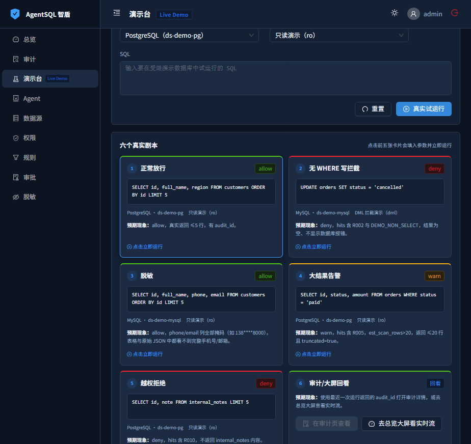

# AgentSQL 快速上手

> 发布状态：本文对应 AgentSQL v0.4.0。一键安装命令与 `ghcr.io/cuipengdba/agentsql:v0.4.0` 镜像可用于部署，也可按本文「源码 / Live Demo」路径从本地构建体验。源码仓库为 `github.com/cuipengdba/agentsql`。

AgentSQL 是放在 AI Agent 与业务数据库之间的数据库安全网关和生产级 MCP Server，让每条 SQL 在执行前经过身份、权限、规则和决策检查，并在可审计的边界内执行。

```text
人 → AI Agent / LLM → MCP → AgentSQL → PostgreSQL / MySQL 业务库
```

AgentSQL 不是 BI、ORM 或 Text2SQL，不负责把自然语言转换成 SQL，也不替代数据库账号与权限体系。数据库侧的最小权限运行账号始终是最后一道防线。

## 你将得到什么

- 为每个 Agent 分配独立 API Key 和 `readonly`、`dml`、`ddl` 能力档位。
- 按 Agent × 数据源 × 对象建立默认拒绝的授权策略。
- 对单条 SQL 做解析、规则判断、受控执行、结果限行和基础脱敏。
- 在控制台查看 `allow`、`deny`、`warn`、`approve`、`error` 的证据链与应用层审计。
- 通过 Streamable HTTP 或 stdio 向 MCP 客户端提供七个固定工具。

## 明确不做什么

- 不替代数据库账号、网络隔离、TLS 终止、备份、监控与变更管理。
- 不保护绕过 AgentSQL 直连数据库的请求。
- MCP 多语句事务与跨请求会话能力随 v0.4.0 交付，但 B5 出厂默认关闭，需显式开启并完成数据源能力核验；默认（未开启 B5）时仍只允许单条顶层 SQL，不允许 stacked SQL（堆叠语句）或跨请求事务。
- 审批通过不会自动执行 SQL；审计不是法规级 WORM。
- 当前不支持完整 DLP、企业身份、高可用或 Kubernetes 编排。

## 前置条件与兼容矩阵

| 范围 | 当前支持 | 说明 |
| --- | --- | --- |
| 一键安装宿主 | `linux/amd64`、`linux/arm64`；glibc 2.28+、systemd | v0.4.0 起提供 linux/arm64 原生 glibc 包；`x86_64` / `amd64` 对应 amd64，`aarch64` / `arm64` 对应 arm64 |
| 其他宿主 | Docker / Docker Compose | musl / Alpine、CentOS 7 与上述两种架构之外的平台不提供原生包；发布容器镜像仍为 amd64 |
| 业务数据库 | MySQL 8；PostgreSQL 14–18 | 为 AgentSQL 创建独立、最小权限运行账号 |
| 控制面存储 | SQLite；PostgreSQL 15+ | SQLite 为默认；PostgreSQL 可分离 metadata 与 audit |
| 浏览器控制台 | `http://127.0.0.1:7780` | 默认绑定回环地址 |
| 本地 Live Demo | Docker Engine / Docker Desktop、Docker Compose v2 | 从源码构建，不依赖 GHCR |

## 路径 A：5 分钟零配置看效果（现在就能跑）

这是专用 Demo 模式：使用合成数据和固定演示身份，`POST /api/v1/playground/run` 只在该模式注册。普通 `/playground/assess` 仅做解析与静态规则评估，不连接数据库、不执行 SQL、也不写审计。

先克隆当前源码仓库并进入根目录。Live Demo 使用独立的 `docker-compose.demo.yml`（Compose 项目名 `agentsql-demo`、控制台端口 17880、内置固定种子数据与演示身份），**不要**用根目录的 `docker-compose.yml`。先按 [本地 Live Demo](DEMO.md) 准备演示凭据，再用重置脚本一条命令构建、播种并启动：

```bash
# 1) 复制演示环境文件，并按 docs/DEMO.md 替换其中的公开示例值
#    （AGENTSQL_SECRET、管理员密码、演示库 owner/ro 密码、两个演示 Agent Key）
cp examples/docker/demo.env.example demo/demo.env

# 2) 一条命令构建镜像、播种固定数据并启动（会重建演示数据；从源码构建，不依赖 GHCR）
bash ./demo/reset.sh        # Windows PowerShell 用：.\demo\reset.ps1
```

脚本完成后打开 <http://127.0.0.1:17880>，用 `demo/demo.env` 中的管理员账号和密码登录。完整凭据说明、端口映射、每日 04:00 重置与故障排查见 [DEMO.md](DEMO.md)。

在「演示台」按顺序查看六张卡：

1. PostgreSQL 只读查询放行，返回不超过 5 行并生成审计。
2. MySQL 无 `WHERE` 的 `UPDATE` 被 R002 与 Demo 只读屏障拦截，不触达业务库。
3. MySQL 查询返回的 `phone`、`email` 被结果层脱敏。
4. PostgreSQL 大结果在 Demo 阈值下命中 R005，最多返回 20 行并显示 `truncated=true`。
5. 访问未授权 `internal_notes` 被 R010 拒绝，不返回表内容。
6. 用最近一次 `audit_id` 打开审计详情，并在总览大屏回看实时事件。



真实运行截图还可查看 `images/demo-scenario-1.png` 至 `images/demo-scenario-6.png`。上述 R005 告警是 Demo 模式专用动态阶段，不代表普通生产流水线默认会产生同一告警；生产环境始终应依赖执行层 `row_limit` 截断作为结果上限。

## 路径 B：接入你自己的库（真实生产闭环）

下面步骤必须按顺序完成，缺少授权策略时即使已经创建数据源和 Agent，也不能访问任何表。

### 1. 安装并启动

**v0.4.0 起提供 linux/arm64 原生 glibc 包：**一键安装支持 `linux/amd64`（`uname -m` 为 `x86_64` / `amd64`）和 `linux/arm64`（`aarch64` / `arm64`），均要求 glibc 2.28+、systemd，且命令需要 root 权限：

```bash
# 适用前提：v0.4.0 起；linux/amd64 或 linux/arm64 + glibc 2.28+ + systemd
curl -fsSL https://github.com/cuipengdba/agentsql/releases/latest/download/install.sh | sudo sh -s -- install
```

除一键安装外，也可按 [部署指南](DEPLOY.md) 使用源码或 Docker Compose 构建，或拉取 `ghcr.io/cuipengdba/agentsql:v0.4.0` 镜像；发布资产以 GitHub Releases 页面为准。

### 2. 登录控制台

打开 <http://127.0.0.1:7780>，默认管理员用户名是 `admin`。非交互安装不会把随机密码打印到终端；root 可读取 `/etc/agentsql/agentsql.env`，或重新安装时显式加 `--show-password`。

### 3. 添加数据源

先在业务库中为 AgentSQL 单独创建最小权限运行账号，绝不要使用 `superuser`、数据库 owner 或 MySQL `root`。在「数据源」填写 `host`、`port`、`database`、`username`、`password`，按实际查询需要授予最少的表权限，然后点击「测试连接」。

当前数据源表单没有 SSL mode、CA、客户端证书或 DSN 附加参数字段；需要远程链路 TLS 时，请在受控网络或代理层完成，并验证端到端配置。

### 4. 创建 Agent

在「Agent」创建身份，选择能力档位：

- `readonly`：只读查询。
- `dml`：查询及 `INSERT`、`UPDATE`、`DELETE`。
- `ddl`：包含结构变更能力。

保存创建后只显示一次的 API Key。请立即放入客户端的秘密存储，不要写入仓库或聊天记录。

### 5. 建立最小 allow 权限策略

> **关键步骤：AgentSQL 默认无授权即拒绝。光创建数据源和 Agent，仍访问不了任何表。**

在「权限」中新建绑定该 Agent 与数据源的 `allow` 策略，从确实需要的单张表开始，例如 `public.customers` 或 `customers`。不要用 `*` 或 `schema.*` 做普通示例：两者虽然合法，却代表整表全列授权，会让列级白名单失效。

### 6. 接入 MCP 客户端

已由安装器或 systemd 运行服务时，首选 Streamable HTTP。按 [MCP 接入指南](INTEGRATIONS.md) 把下列最小骨架合并到客户端配置；客户端具体文件路径和 HTTP transport 键名以该客户端官方 MCP 文档为准：

```json
{
  "mcpServers": {
    "agentsql": {
      "url": "http://127.0.0.1:7780/mcp",
      "headers": {
        "Authorization": "Bearer <Agent API Key>"
      }
    }
  }
}
```

重启或重新加载客户端后，先调用 `list_datasources` 和 `list_schema`。再通过 `query` 发送一条已授权、带 `WHERE` 的单条 `SELECT`：

```sql
-- 适用前提：替换为已授权的真实表和列；通过 MCP query 工具提交
SELECT id, name FROM public.customers WHERE id = 1 LIMIT 10;
```

在「审计」页确认出现 `allow`。随后用 `readonly` Agent 通过 `execute_write` 发送一条无 `WHERE` 的更新，并填写 `reason`：

```sql
-- 适用前提：仅用于验证拦截；通过 MCP execute_write 工具提交并填写 reason
UPDATE public.customers SET name = 'blocked-test';
```

该请求应被 R002（无条件批量写）和/或 R003（只读 Agent 写操作）拒绝，不触达业务库；在审计页确认 `deny`。工具层前置拒绝可能发生在流水线之前，因此缺少 `reason` 等错误不保证产生审计；验收时必须填写 `reason`。

## 5 分钟验收清单

- `GET /healthz` 返回 HTTP 200，JSON 中 `status` 为 `ok` 且包含 `version`。
- `GET /readyz` 返回 HTTP 200。
- 控制台「审计」页至少有 1 条 `allow` 与 1 条 `deny`。
- `deny` 详情显示命中规则，且目标业务表没有发生更新。
- API Key、数据库密码和 `AGENTSQL_SECRET` 未写入命令历史、仓库或公开日志。

```bash
# 适用前提：AgentSQL 已在本机 127.0.0.1:7780 运行
curl -fsS http://127.0.0.1:7780/healthz
curl -fsS -o /dev/null -w '%{http_code}\n' http://127.0.0.1:7780/readyz
```

## 下一步

- [使用手册](USER_GUIDE.md)：按控制台菜单学习每项能力及边界。
- [敏感列发现指南](DISCOVERY.md)：显式表范围、采样安全、置信度与脱敏草稿边界。
- [MCP 接入指南](INTEGRATIONS.md)：两种传输、七工具、调用时序和客户端配置。
- [部署指南](DEPLOY.md)：源码、Compose、systemd、升级、备份和控制面迁移。
- [本地 Live Demo](DEMO.md)：完整演示凭据、重置脚本与安全清单。
